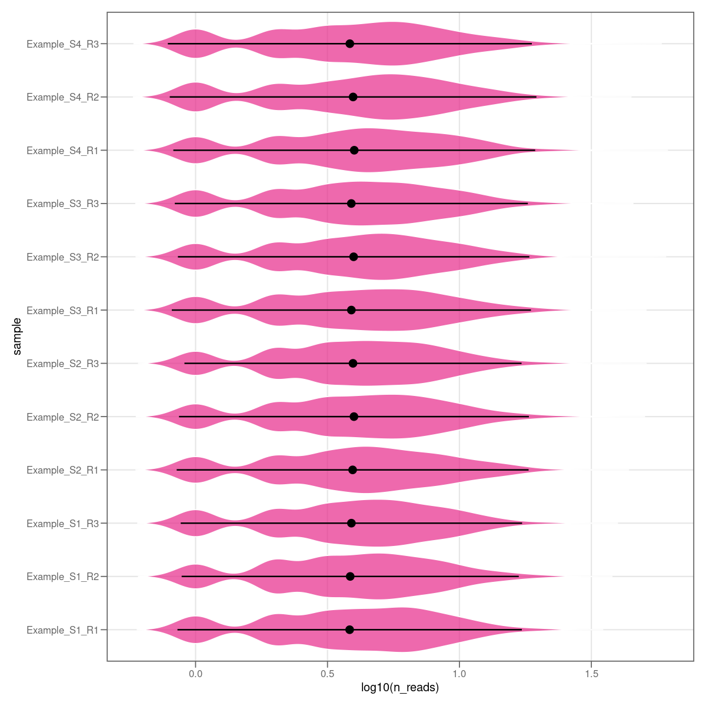
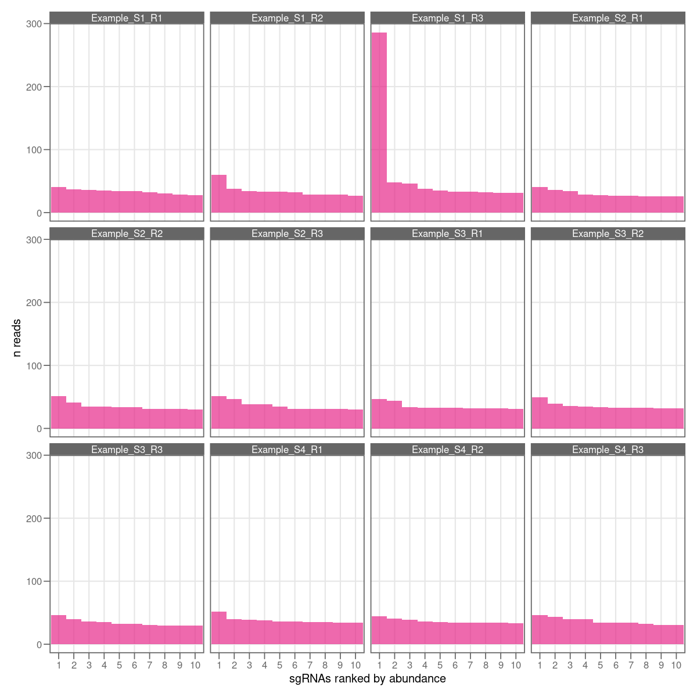
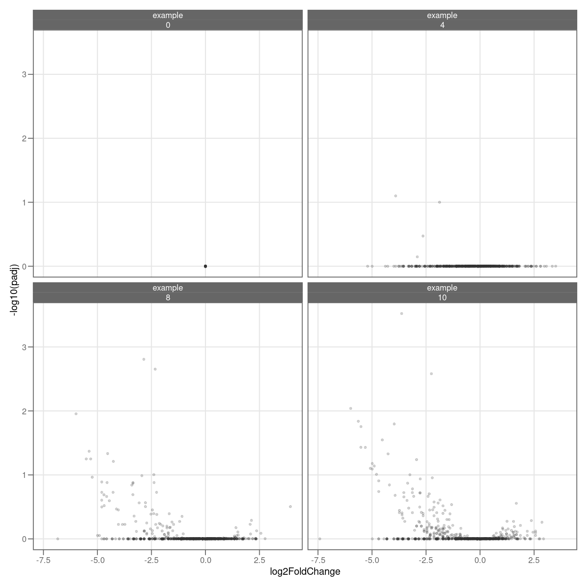

CRISPRi-lib-pipe
================================
Michael Jahn, Kiyan Shabestary

### Description

Pipeline to process CRISPRi library sequencing data

### Related publications

- Yao et al., *Pooled CRISPRi screening of the cyanobacterium Synechocystis sp PCC 6803 for enhanced industrial phenotypes*, [Nature Communications](https://www.nature.com/articles/s41467-020-15491-7), **2020**. Preprint is available at [BioRxiv.org](https://www.biorxiv.org/content/10.1101/823534v2).

### Prerequisites

- `bs-cp` tool from Illumina (optional)
- `bcl2fastq` for NGS file conversion (optional)
- [sickle](https://github.com/najoshi/sickle),
  [bowtie2](http://bowtie-bio.sourceforge.net/bowtie2/index.shtml), 
  and [samtools](http://www.htslib.org/doc/) >= 1.10
- `R` >= 4.0, packages `DESeq2`, `DescTools`, `Hmisc`, `tidyverse`, `limma`
- sequencing data in `fastq.gz` format (gzip compressed)
- sgRNA library reference file in `fasta` format to assign reads

On Ubuntu flavored linux you can install the main tools from the official repositories:

```
sudo apt install sickle
sudo apt install bowtie2
sudo apt install samtools
```

### Usage

#### Step 1: Retrieving data from Illumina basespace *via* command line (optional)

Data in form of `*.fastq` files can be manually downloaded from the basespace website on MacOS or Windows.
For Linux systems, only the command line option is available via Illumina's basespace client `bs-cp`. Files are in Illumina's proprietary format. Execute the following line in a terminal and replace `<your-run-ID>` with the number you will find in the URL of your browser. For example, log in to basespace, navigate to `runs`, select a sequencing run and copy the ID you find in the URL: `https://basespace.illumina.com/run/200872678/details`.

```
bs-cp -v https://basespace.illumina.com/Run/<your-run-ID> /your/target/directory/
```

The data must then be converted to `*.fastq` (plain text) files using Illumina's `bcl2fastq` tool. It is recommended to run it with option `--no-lane-splitting` in order to obtain one file per sample, instead of several files subdivided by lane. If it complains about indices being too similar to demultiplex, the option `--barcode-mismatches 0` can be added.

```
cd /your/target/directory/
bcl2fastq --no-lane-splitting
```

The gzipped `*.fastq.gz` files will be stored in `./Data/Intensities/BaseCalls/`. To merge replicates of the same sample into a new `*.fastq.gz` file (usually not required!), run the following script. The script merges files matching a certain `pattern` into a single new file. Input and output folder can be specified with optional parameters (the default is current directory `./`). New file names are truncated to the part preceding the variable pattern (all characters trailing the pattern are ignored).

- `input_dir` - input directory
- `output_dir` - output directory
- `file_ext` - file extension of the target files (default: `fastq.gz`)
- `pattern` - all files matching this pattern will be merged (default: `_L00[1-4]_`)

```
source/merge_fastq_files.sh --input_dir data/fastq/ --output_dir data/fastq/ --pattern _R.
```

`fastq.gz` files can be manually inspected in the terminal by using the following command. This can be useful
to determine read length and format of the downloaded files.

```
zcat file.fastq.gz | head -n 1
```

#### Step 2: Pipeline for read trimming and mapping to reference

This script filters reads using `sickle`, and maps them to the sgRNA library reference. The script takes the following (optional) input parameters:

- `input_dir` - input directory (default `./`)
- `output_dir` - output directory (default `./`)
- `pattern` - the file name pattern to look for (default `.fastq.gz`)
- `read_length` - expected read length for `sickle` (default: `51`)
- `ref_file` - reference library file for reads assignment (default: `./ref/Synechocystis_v2.fasta`)

The following example processes `fastq.gz` files from the `data/fastq/`) directory. Output are filtered `fastq.gz` files, `.bam` alignment files, and `counts.tsv` summary tables, one for each input file.

```
source/map_reads.sh --input_dir data/fastq/ --output_dir data/output/
```

#### Step 3:  Quantify differential abundance (DESeq2) and calculate fitness score

This step summarizes count tables per sample to one main table, adds statistical metrics for a pairwise sample comparison using [DESeq2](https://pubmed.ncbi.nlm.nih.gov/25516281/), and calculates fitness scores per gene and condition. Mandatory inputs are 1) the `counts.tsv` files from the previous step, and a tab-separated sample annotation table, `metadata.tsv`. The structure of this table is shown here: 

```
file_name                   condition replicate date        time group reference_group
Example_S1_L001_R1.fastq.gz cond_A            1 2021-03-26     0     1               1
Example_S1_L001_R2.fastq.gz cond_A            2 2021-03-26     0     1               1
Example_S2_L001_R1.fastq.gz cond_B            1 2021-03-26     0     2               1
Example_S2_L001_R2.fastq.gz cond_B            2 2021-03-26     0     2               1
```

The entries in the `file_name` column correspond to the names of the `fastq.gz`/`counts.tsv` files. Two more columns are particularly important, `group` and `reference_group`. These columns define the condition to which each sample belongs, and to which this condition should be compared to, in order to obtain statistics like log2 fold change and p-value. The `time` column is used to calculate fitness score over a number of generations within one `condition`. Other `time` units are possible too as long as the input is numeric. If only one time point is supplied for all samples, fitness calculation is omitted. The zero time point should normally be identical with the reference condition. Fitness `F` of a gene `g` is calculated as the area under the curve of log2 fold change over time `t`, normalized by total duration of the experiment.

$F_g = \frac{AUC(t, log_2 FC)}{max(t)/2}$

For an ideal gene depleting or enriching at a constant rate, the fitness score equals the log2 fold change at the final time point. 

The main output from the pipeline are two tables in `.Rdata` format (memory-efficient), `DESeq2_result.Rdata` and `DESeq2_intermediate.Rdata`. The first one is the main result table containing the final statistics for desired comparisons. In addition, summary plots for number of reads per sample, per sgRNA, total quantified sgRNAs per sample, and a volcano plot for log2 FC versus negative log10 p-value are exported in `.png` and `.pdf` format. All files are saved to the folder specified with `--counts_dir`. The script takes the following (optional) input parameters:

- `metadata_dir` -  metadata directory (default `./`)
- `counts_dir` - counts directory (default `./`)
- `normalization` - optional argument to specify if count matrix should be normalized between conditions, but separated by time points. Possible values are `none` (default), `quantile` or `cyclicloess`. These are passed down to `normalizeBetweenArrays()` from package `limma`


```
source/calculate_gene_fitness.sh --metadata_dir data/fastq/ --counts_dir data/output/
```

#### Example of graphical summary

Total number of mapped reads    |  Distribution of log10 number of reads, per sgRNA
:-------------------------:|:-------------------------:
  |  

Top 10 sgRNA mutants by read number    |  Volcano plot, log2 FC vs -log10 p-value
:-------------------------:|:-------------------------:
  |  

